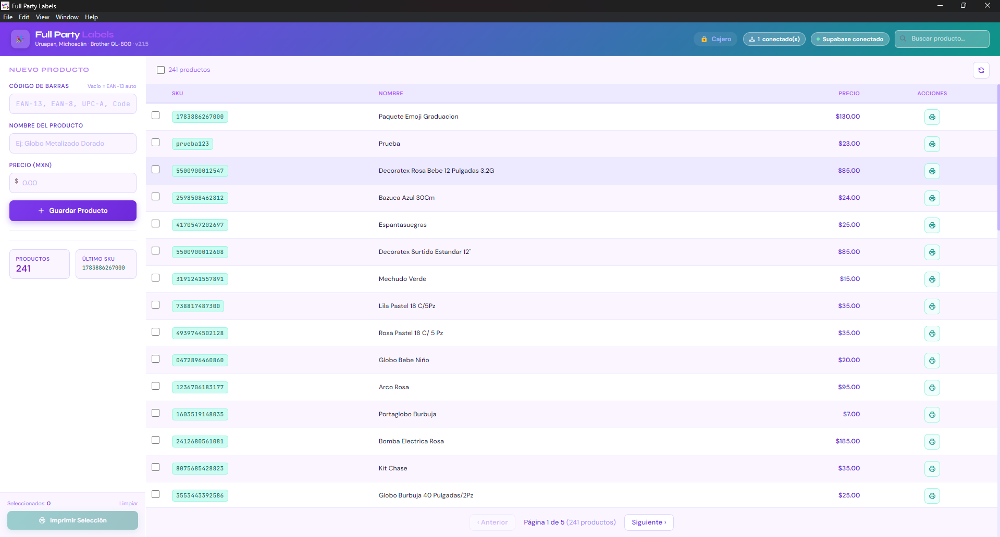
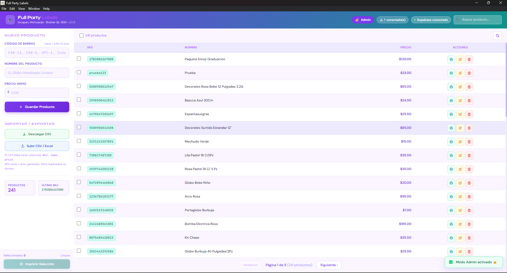
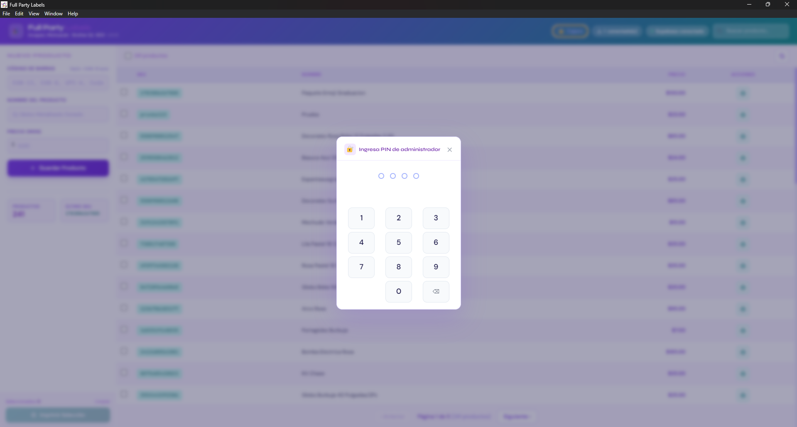
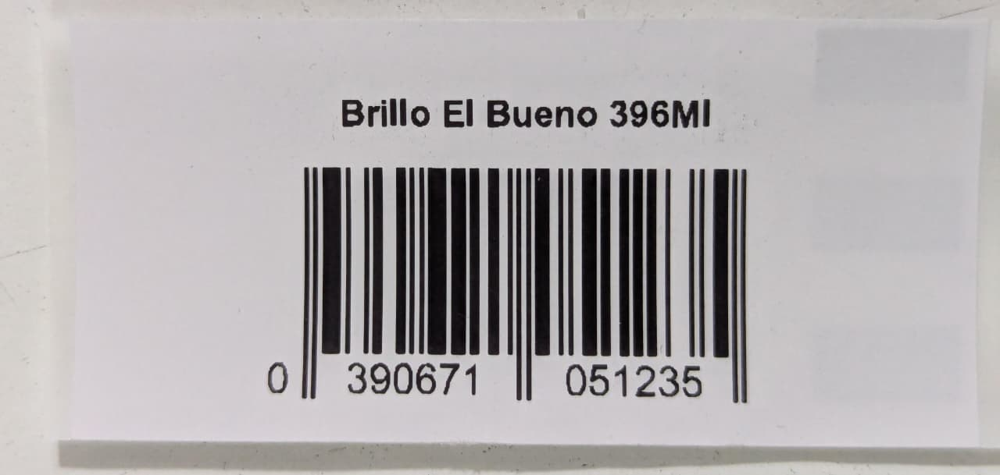
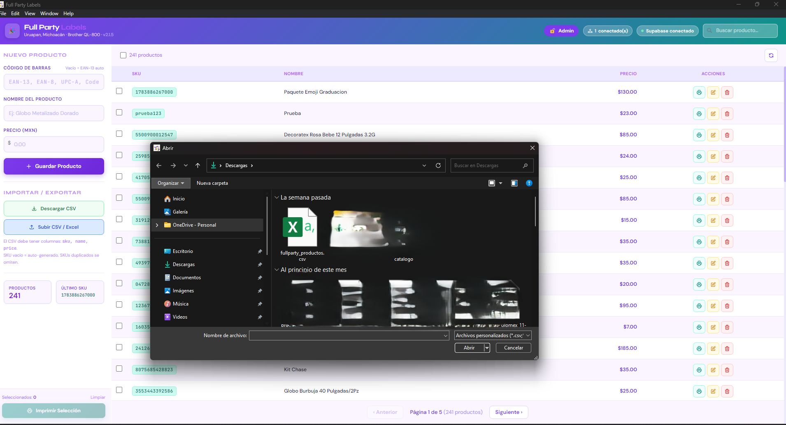

<div align="center">

# 🎉 Full Party Labels

**Sistema de etiquetas con código de barras para cadena de tiendas de artículos para fiestas**


</div>

---

## 🧩 El problema que resuelve

Al manejar artículos de importación de origen chino, la mayoría llega **sin código de barras**, o peor aún, **productos distintos vienen con el mismo código**, lo que hacía imposible llevar un inventario confiable.

A esto se suma que la tienda opera con **múltiples sucursales**: era necesario que todas manejaran los mismos códigos para tener control real sobre lo que entra y sale en cada punto de venta.

**Full Party Labels** resuelve esto generando códigos EAN-13 únicos por producto, sincronizando el catálogo en tiempo real entre sucursales a través de Supabase, y permitiendo imprimir etiquetas profesionales al instante desde cualquier PC de la tienda.

---

## 📦 Descargar

Descarga el instalador más reciente en la sección [**Releases**](../../releases/latest).

---

## 🖥️ Stack tecnológico

| Capa | Tecnología |
|------|-----------|
| Desktop | Electron.js 28 + HTML5 + Tailwind CSS |
| Backend local | FastAPI (Python 3.13) empaquetado con PyInstaller |
| Base de datos | Supabase (PostgreSQL) — sincronización en tiempo real |
| Impresora | Brother QL-800 — etiquetas 62×29mm |
| Distribución | electron-builder + electron-updater (GitHub Releases) |

---

## ✨ Funcionalidades

- 🏷️ **Múltiples formatos de código de barras** — EAN-13, EAN-8, UPC-A y Code128
- ⚡ **SKU auto-generado** — genera EAN-13 únicos si el producto no tiene código
- 🖨️ **Impresión de etiquetas PDF** 62×29mm optimizadas para Brother QL-800
- 👥 **Sistema de roles con PIN** — Modo Cajero (lectura/impresión) y Modo Admin (gestión completa)
- 📊 **CRUD de productos** con búsqueda en tiempo real y paginación
- 📥 **Importar/Exportar CSV y Excel** — carga masiva de catálogo
- 🌐 **Multi-sucursal** — todas las PCs ven el mismo inventario vía Supabase
- 📡 **Modo offline** — opera sin internet y sincroniza al reconectar
- 🔄 **Auto-actualizaciones** — banner de nueva versión sin intervención del usuario

---

## 📸 Capturas de pantalla

### Pantalla principal


### Modo Cajero — controles restringidos


### Modo Admin — acceso completo


### PIN de seguridad


### Etiqueta generada para Brother QL-800


### Importar inventario CSV/Excel


---

## 🏗️ Arquitectura

```
┌─────────────────────────────┐
│   Electron (Renderer)       │  ← UI: HTML + Tailwind + Vanilla JS
│   index.html / app.js       │     Modo offline con cola de sync
└────────────┬────────────────┘
             │ HTTP localhost:8000
┌────────────▼────────────────┐
│   FastAPI Backend           │  ← Python 3.13 compilado a .exe
│   servidor_etiquetas.py     │     REST API + generación de PDFs
│   (PyInstaller .exe)        │     con ReportLab + códigos de barras
└────────────┬────────────────┘
             │ SQLAlchemy + psycopg2
┌────────────▼────────────────┐
│   Supabase (PostgreSQL)     │  ← Base de datos en la nube
│   products / presence       │     Sincronización multi-sucursal
└─────────────────────────────┘
```

---

## 🔧 Retos técnicos resueltos

**Productos sin código de barras**
La mayoría del inventario importado de China no trae código. Se implementó un generador de EAN-13 con validación de dígito verificador y verificación de unicidad en base de datos antes de asignar.

**Códigos duplicados en productos distintos**
Productos diferentes llegaban con el mismo código de fábrica. Se forzó unicidad a nivel de base de datos y se permite sobreescribir con un SKU personalizado o auto-generado.

**Operación sin internet**
Las sucursales a veces pierden conexión. Se implementó una cola de operaciones en `localStorage` que se sincroniza automáticamente al recuperar la conexión, sin pérdida de datos.

**Roles sin backend de autenticación**
Para evitar que empleados borren productos o modifiquen precios por error, se implementó un sistema de roles (Cajero / Admin) con PIN local por PC, sin necesidad de servidor de autenticación.

**Auto-actualizaciones en app de escritorio**
Se configuró `electron-updater` con un repositorio público separado para los releases, manteniendo el código fuente en un repo privado y sin exponer credenciales dentro del instalador.

---

## 🔄 Auto-actualizaciones

Cada nueva versión publicada en GitHub Releases notifica automáticamente a todos los equipos instalados. El usuario ve un banner y puede instalar con un clic sin descargar nada manualmente.

---

## 📄 Licencia

Uso interno — Full Party, Uruapan, Michoacán 🎉
